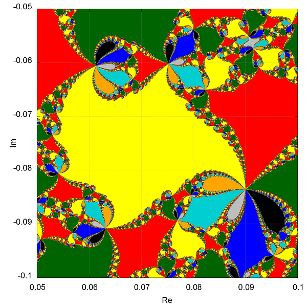
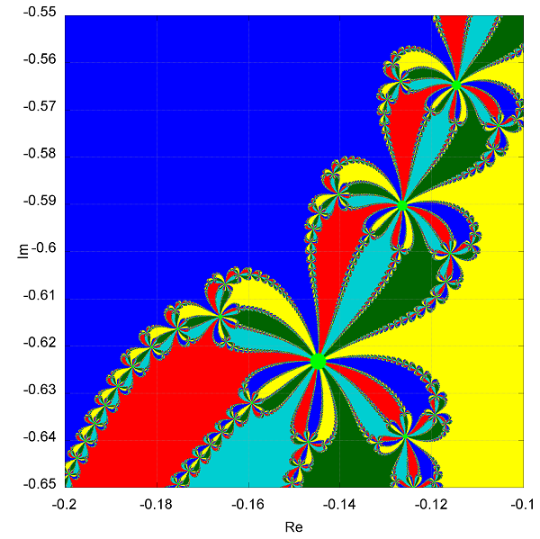

## **Boxes Counting**

Numeric program, which main purpouse is computing fractal dimensions.

Program functions:
- [x] drawing fractal picture with gnuplot (using pipes to automatically communicate with program)
- [x] boxes algorithm implementation
- [x] computing fractal dimension

Examples of generated fractals:

Computed boxes dimension: 1.58

Boxes dimension: 1.65